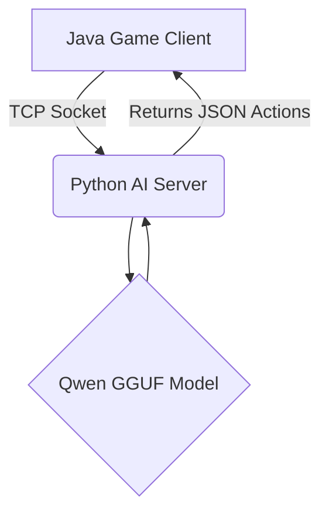

# 🏗️ City AI: Architecture & Lore

This document outlines the technical architecture, data structures, and the foundational lore of **Valle Silencio** (Silence Valley).

---

## 1. System Architecture

The simulation is divided into two distinct, decoupled environments communicating via TCP Sockets.

### The Workflow
1. **Java Client:** Holds the world state. It sends the complete prompt (context) to the Python server.
2. **Python Server:** Appends strict system instructions (e.g., "You are an NPC, not an AI") to ground the model.
3. **Qwen LLM (RAM/GPU):** Generates a response based on the context.
4. **Python Server:** Parses the output and returns only the plain text and variables.
5. **Memory:** The AI does *not* retain memory. The Java client handles memory storage and feeds it back on the next turn.

---

## 2. AI Communication Protocol

The Java client sends the context, and the AI must respond with specific parseable tags:

- **`RESRES`**: The chosen action or dialogue based on the context.
- **`RESTIME=Xm`**: Time the character will spend performing the action (in minutes).
- **`RESVOL=XdB`**: The volume of the action (0dB to 200dB). Higher volume means other NPCs further away will "hear" it and it will be added to their context.
- **`LLME3`**: (Optional) Feedback or suggestions from the AI to improve context precision for future interactions.

---

## 3. Character Data Structure (JSON)

Each character (NPC) is instantiated as an object in Java and relies on multiple JSON data blocks:

### State Variables
- Current Date (Year, Day, Month)
- Current Time
- Calculated metrics: e.g., `Hours_Awake = Current_Time - Last_Time_Slept`
- Physical State: *"You've been awake for 16 hours, your eyes are heavy."*

### Base Biography JSON
- Full Name, Gender, Age, Date of Birth
- Personality, Parents
- Health Status
- Timestamps: Last slept, last showered, last bathroom use
- Exact Location

### Relational JSONs
- **Recent Conversations:** History of the latest actions and dialogues.
- **Relationship Matrix:** Specific history/relationship score with the NPC they are currently interacting with.

---

## 4. The Town: Valle Silencio

### Locations & Buildings
*Actions vary depending on the NPC's job and the building they are in.*
- City Hall, Municipal Library, Post Office, Police Station
- Clinic, Pharmacy, Cemetery (with Church)
- School, High School, Park, Plaza, Outskirts Walkway
- Farm, Hotel (5 rooms), Bar, Restaurant, Supermarket, Bank, Hair Salon

### Required NPC Roles
Mayor, Mayor's Clerk, Librarian, Doctor, Surgeon, Pharmacist, Priest, Gravedigger, Messenger, Sheriff, Police Officer, Plumber, Electrician, Locksmith, Teachers (Preschool & High School), Farmer, Hotel Manager, Chefs, Waiters, Cashier, Stocker, Hairdresser, Banker, Tramp.

---

## 5. Lore & Families

**The Pact of 1885**
The town was officially founded in 1885. Two families of settlers (ancestors of the current Mayor and the Farmer) arrived in the valley fleeing civil wars. Finding nothing but dirt and a river, they signed the "Treaty of Partition" to avoid killing each other:
- **The Land** went to the Farmer's ancestors.
- **The Town** went to the Mayor's ancestors.

Since that day, the town grew under one unwritten rule:
> *"Nobody comes from outside, nobody leaves forever."*

### Initial Family Trees
* **Mayor (1961) & Librarian (1972)** -> Mayor's Clerk (1994) / Police (1996)
* **Banker (1971) & Hairdresser (1974)** -> Cashier (1995) / Stocker (1997)
* **Farmer (1968) & HS Teacher (1973)** -> Sheriff (1993) / Locksmith (1995)
* **Doctor (1975) & Surgeon (1977)** -> Pharmacist (1998) / Nurse
* **Gravedigger (1972) & PreK Teacher (1975)** -> Plumber (1996) / Electrician (1998)
* **Hotel Manager (1976) & Hotel Chef (1978)** -> Bar Waiter (2000) / Bar Chef (2002)
* **Rest. Chef (1978) & Rest. Waiter (1980)** -> Messenger (2001) / Clerk Messenger (2003)
* **Priest (1980)** -> Orphan
* **The Tramp (1965)** -> Parents murdered (the only ones in the new cemetery 😉)

---
*Note: The Python server uses an "Anchoring" system to prevent hallucination. A fixed system prompt constantly reminds the model: "You are an inhabitant of a realistic town in 2026. Magic does not exist. Your actions must be logical for a human."*
